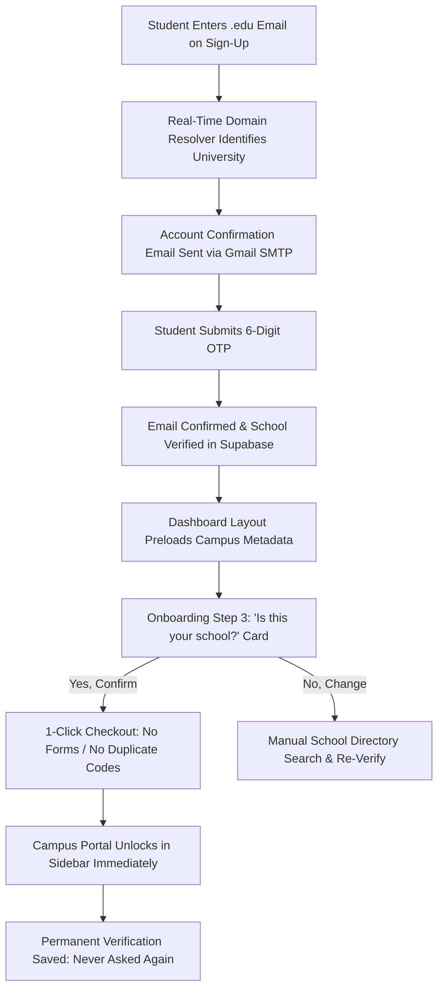
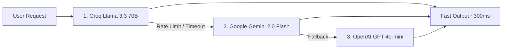

<div align="center">

# ⚡ ResumeForge

### *The Autonomous AI Career Workspace & Campus Network for Students & Early Professionals*

[](https://resume-builder-plan.vercel.app/)
[](https://github.com/MeeksonJr/resume-builder-plan)
[](LICENSE)

[](#)
[](#)
[](#)
[](#)
[](#)
[](#)
[](#)

> **ResumeForge** is an end-to-end, AI-powered career operating system built exclusively for college students and early-career talent. Create ATS-beating resumes, practice real-time AI mock interviews with voice and STAR evaluation, leverage automated academic email verification, and unlock exclusive campus cohort directories — all inside a cohesive, liquid-animated glassmorphic workspace.

---


</div>

---

## 📑 Table of Contents

- [✨ Key Capabilities](#-key-capabilities)
- [🎓 Smart Academic Onboarding & Campus Lifecycle](#-smart-academic-onboarding--campus-lifecycle)
- [🏗 Architecture & Security Model](#-architecture--security-model)
- [🧭 Sidebar & Dynamic Navigation System](#-sidebar--dynamic-navigation-system)
- [📧 Verified Email Delivery Engine](#-verified-email-delivery-engine)
- [🤖 Multi-LLM Orchestration Stack](#-multi-llm-orchestration-stack)
- [🛠 Tech Stack & Core Libraries](#-tech-stack--core-libraries)
- [🚀 Quickstart & Setup Guide](#-quickstart--setup-guide)
- [⚙️ Environment Variables Reference](#️-environment-variables-reference)
- [🗄 Database Schema & RLS Policies](#-database-schema--rls-policies)
- [📂 Clean Project Hierarchy](#-clean-project-hierarchy)
- [🗺 Roadmap & Next Milestones](#-roadmap--next-milestones)

---

## ✨ Key Capabilities

### 🎨 Liquid Auth & Frictionless Identity
- **Two-Column Liquid Auth Interface:** Full-width layout featuring glassmorphism cards and smooth water-wave transitions across Sign In, Sign Up, and Confirm Email states.
- **Smart Academic Email Detection:** Typing any `.edu`, `vccs.edu`, `.ac.uk`, or consortium address instantly identifies the university and primes campus access before the user even finishes typing their password.
- **24-Hour Instant Sandbox Trial:** New users and guests can activate a 24-hour instant demo session without upfront barriers.
- **Triple-Layer Lockout Protection:** Middleware routing, server-side layout enforcement, and inescapable client modals prevent URL-tampering or unauthorized bypass.
- **Floating Island Navigation:** Dynamic dark/light theme toggle with persistent contrast memory.

### 🎓 Smart University Onboarding & Campus Network
- **Zero-Friction Institutional Checkout:** Students who sign up with an `.edu` email have their verification handled during authentication. In onboarding, they are presented with an intelligent **"Is this your school?"** summary card displaying discovered campus data. A single click confirms their institution and skips redundant verification forms.
- **Dedicated Sidebar Campus Portal:** Once verified, the university portal link (`/dashboard/portal/[slug]`) automatically unlocks in the navigation, providing instant access to student directories, peer reviews, and campus recruiters.
- **Real-Time Cross-Component Sync:** Internal event bus (`rf-profile-updated`) ensures sidebar navigation, profile settings, and campus badges re-render immediately upon verification without requiring page reloads.
- **Canvas LMS Deep Integration:** Alternative verification route via Canvas API tokens that pulls active courses, GPA, and term projects straight into resume bullet drafting.
- **Reverse Job Board Marketplace:** Verified student profiles can be indexed in the recruiter marketplace where employers initiate direct candidate discovery.

### 📄 Intelligent Resume & Portfolio Studio
- **Deep PDF Extraction:** Ingest any existing PDF CV and extract clean, structured JSON schemas in seconds.
- **Multi-LLM Bullet Enhancer:** Transform vague experiences into high-impact, metric-driven achievements using STAR principles.
- **Real-Time ATS Scorer:** Live keyword density, formatting checks, and action-verb strength metrics tailored against target job descriptions.
- **Interactive Portfolio Builder:** Drag-and-drop customizable microsites with public vanity URLs (`/p/[slug]`) to showcase live projects, verified campus status, and resume downloads.
- **Full Version Snapshots:** Every change creates an immutable history record with 1-click rollbacks.

### 🎤 Voice-Enabled AI Mock Interview Simulator
- **Adaptive Question Generator:** Pulls context directly from your resume and targeted job role to produce behavioral, technical, and situational prompts.
- **Live Voice Speech-to-Text:** Speak answers naturally using browser Web Speech APIs with live transcription.
- **STAR Rubric Evaluation:** Comprehensive breakdown measuring Situation, Task, Action, and Result with concrete suggestions and model answer scripts in under 2 seconds.

---

## 🎓 Smart Academic Onboarding & Campus Lifecycle

ResumeForge eliminates duplicate verification work by connecting the signup phase with the onboarding process:



### Institutional Verification Comparison
| Verification State | User Experience | Campus Access |
|---|---|---|
| **.edu Signup Email** | Auto-detects institution on signup; 1-click confirmation in onboarding. Zero duplicate codes. | Full Campus Portal & Directory Unlocked |
| **Personal Email + School Verify** | Prompted in Onboarding Step 3 or Settings. Enter `.edu` email to receive real Gmail SMTP OTP. | Full Campus Portal Unlocked after Code Verification |
| **Canvas LMS Token** | Enter Canvas instance URL and access token. Verifies enrolled courses and student identity. | Full Campus Portal & Course Sync Unlocked |
| **Non-Student / Professional** | Click "Continue without School" during onboarding. Never asked again. | Standard Career Tools (Resume, Jobs, Interviews) |

---

## 🏗 Architecture & Security Model

```
┌─────────────────────────────────────────────────────────────────┐
│ Layer 1: Edge Middleware (middleware.ts)                        │
│ ├─ Inspects all /dashboard/* incoming requests                  │
│ ├─ Validates Supabase JWT session & expiration                  │
│ └─ Verifies demo_trial_started_at against 24-hour limit         │
└───────────────────────────────┬─────────────────────────────────┘
                                │ Passes
                                ▼
┌─────────────────────────────────────────────────────────────────┐
│ Layer 2: Server Layout (app/dashboard/layout.tsx)               │
│ ├─ Fetches verified user profile from PostgreSQL                │
│ ├─ Auto-syncs academic .edu email confirmation to school status │
│ ├─ Mounts VerificationGateModal if trial expired/unverified     │
│ └─ Injects fully resolved profile into AppSidebar               │
└───────────────────────────────┬─────────────────────────────────┘
                                │ Passes
                                ▼
┌─────────────────────────────────────────────────────────────────┐
│ Layer 3: Reactive Client Layer (AppSidebar & Onboarding)        │
│ ├─ Listens to 'rf-profile-updated' custom event bus             │
│ ├─ Subscribes to Supabase postgres_changes channel              │
│ └─ Derives institutional slug fallback and renders nav items   │
└─────────────────────────────────────────────────────────────────┘
```

---

## 🧭 Sidebar & Dynamic Navigation System

The application sidebar (`components/dashboard/app-sidebar.tsx`) updates reactively when institutional status is confirmed:

1. **Prominent University Section:** When `school_verified` is true, an institutional category appears in the main navigation displaying the verified campus name, direct link to `/dashboard/portal/[slug]`, and cohort directory shortcuts.
2. **Showcase Integration:** The verified school portal is also seamlessly accessible under the **Showcase** section alongside personal portfolio and discovery links.
3. **Resilient Slug Fallback:** If `university_slug` is momentarily empty, the system automatically derives a URL-safe slug from `university_name` or defaults gracefully to `campus`, ensuring navigation never fails.
4. **Instant Event Bus:** Verifications completed in the onboarding dialog, university settings, or link verification pages trigger `window.dispatchEvent(new CustomEvent("rf-profile-updated"))`, immediately causing the sidebar to re-fetch and re-render without a full page refresh.

---

## 📧 Verified Email Delivery Engine

ResumeForge utilizes **Nodemailer with Google Gmail SMTP** (App Passwords) to send clean, high-contrast, transactional emails:

- **High Delivery Rate:** Avoids standard spam/junk filtering common with shared sandbox domains.
- **Enterprise Format:** Fully responsive HTML email templates with ResumeForge branding, dark-mode styling, 6-digit verification code callouts, and expiration countdowns.
- **Clean Architecture:** No sandbox bypasses or mock codes exposed in production UI — real codes are verified securely against `school_verification_codes` with automated TTL expiry.

```typescript
// Production Mailer Configuration (lib/email/nodemailer.ts)
const transporter = nodemailer.createTransport({
  service: "gmail",
  auth: {
    user: process.env.GMAIL_USER,
    pass: process.env.GMAIL_APP_PASSWORD,
  },
});
```

---

## 🤖 Multi-LLM Orchestration Stack

ResumeForge incorporates an intelligent, tiered AI provider architecture with automatic fallbacks:



| Pipeline Task | Primary LLM Provider | Fallback Provider | Target Latency |
|---|---|---|---|
| **Resume Bullet Generation** | Groq (`llama-3.3-70b-versatile`) | Google (`gemini-2.0-flash`) | ~250ms |
| **ATS Compatibility Analysis** | Google (`gemini-2.0-flash`) | Groq (`llama-3.3-70b-versatile`) | ~800ms |
| **Voice STAR Interview Scoring** | Groq (`llama-3.3-70b-versatile`) | Google (`gemini-2.0-flash`) | ~400ms |
| **Cover Letter Tailoring** | Groq (`llama-3.3-70b-versatile`) | OpenAI (`gpt-4o-mini`) | ~600ms |

---

## 🛠 Tech Stack & Core Libraries

- **Frontend & App Framework:** [Next.js 15 (App Router)](https://nextjs.org/) with React 19
- **Type Safety & Validation:** [TypeScript 5](https://www.typescriptlang.org/) & [Zod](https://zod.dev/)
- **Database & Authentication:** [Supabase PostgreSQL](https://supabase.com/) with Row Level Security (RLS)
- **Styling & Design System:** [Tailwind CSS v4](https://tailwindcss.com/) with Radix UI primitives & Lucide Icons
- **Animation & Motion:** [Framer Motion](https://www.framer.com/motion/) & CSS keyframe fluid waves
- **Email Delivery:** [Nodemailer](https://nodemailer.com/) with Gmail SMTP & Resend fallback
- **AI Tooling:** [@ai-sdk/google](https://sdk.vercel.ai/), [@ai-sdk/groq](https://groq.com/), and Vercel AI SDK Core
- **PDF Generation & Parsing:** [@react-pdf/renderer](https://react-pdf.org/) & pdf-parse

---

## 🚀 Quickstart & Setup Guide

### 1. Clone & Install Dependencies
```bash
git clone https://github.com/MeeksonJr/resume-builder-plan.git
cd resume-builder-plan
pnpm install
```

### 2. Configure Environment Variables
Copy the template file to `.env.local`:
```bash
cp .env.example .env.local
```

### 3. Setup Supabase Database
Run migrations using the Supabase CLI or execute SQL files inside `supabase/migrations/` sequentially via the Supabase SQL editor:
```bash
supabase db push
```

Ensure the profiles table contains all required columns for onboarding and institutional access:
```sql
ALTER TABLE public.profiles
  ADD COLUMN IF NOT EXISTS is_student BOOLEAN DEFAULT false,
  ADD COLUMN IF NOT EXISTS university_name TEXT,
  ADD COLUMN IF NOT EXISTS university_slug TEXT,
  ADD COLUMN IF NOT EXISTS school_verified BOOLEAN DEFAULT false,
  ADD COLUMN IF NOT EXISTS school_email TEXT,
  ADD COLUMN IF NOT EXISTS onboarding_completed BOOLEAN DEFAULT false,
  ADD COLUMN IF NOT EXISTS demo_trial_started_at TIMESTAMPTZ,
  ADD COLUMN IF NOT EXISTS is_demo_user BOOLEAN DEFAULT false,
  ADD COLUMN IF NOT EXISTS email_verified BOOLEAN DEFAULT false;
```

### 4. Configure Gmail SMTP Credentials
1. Go to your [Google Account Security Settings](https://myaccount.google.com/security).
2. Enable **2-Step Verification**.
3. Under *2-Step Verification*, navigate to **App passwords**.
4. Generate a new password labeled `ResumeForge` and paste it into `.env.local` as `GMAIL_APP_PASSWORD`.

### 5. Launch the Development Server
```bash
pnpm dev
```
Open [http://localhost:3000](http://localhost:3000) in your browser.

---

## ⚙️ Environment Variables Reference

| Variable | Description | Required |
|---|---|---|
| `NEXT_PUBLIC_SUPABASE_URL` | Supabase Project URL | **Yes** |
| `NEXT_PUBLIC_SUPABASE_ANON_KEY` | Supabase Anonymous Client Key | **Yes** |
| `SUPABASE_SERVICE_ROLE_KEY` | Supabase Service Role Key (Admin operations) | **Yes** |
| `GMAIL_USER` | Gmail address for sending verification emails | **Yes** |
| `GMAIL_APP_PASSWORD` | 16-character Google App Password | **Yes** |
| `GMAIL_FROM_NAME` | Email sender display name (Default: `ResumeForge`) | Optional |
| `GROQ_API_KEY` | Groq API Key for ultra-fast Llama 3.3 generation | **Yes** |
| `GOOGLE_GENERATIVE_AI_API_KEY` | Google Gemini API Key for deep analysis | **Yes** |
| `OPENAI_API_KEY` | OpenAI API Key for fallback text tasks | Optional |
| `NEXT_PUBLIC_APP_URL` | Base application URL for verification links | **Yes** |

---

## 🗄 Database Schema & RLS Policies

<details>
<summary><strong>Click to view primary tables and schemas</strong></summary>

### `public.profiles`
```sql
CREATE TABLE public.profiles (
  id UUID PRIMARY KEY REFERENCES auth.users(id) ON DELETE CASCADE,
  full_name TEXT,
  email TEXT,
  target_role TEXT,
  experience_level TEXT,
  is_student BOOLEAN DEFAULT false,
  university_name TEXT,
  university_slug TEXT,
  school_email TEXT,
  school_verified BOOLEAN DEFAULT false,
  onboarding_completed BOOLEAN DEFAULT false,
  is_pro BOOLEAN DEFAULT false,
  subscription_status TEXT DEFAULT 'inactive',
  demo_trial_started_at TIMESTAMPTZ,
  is_demo_user BOOLEAN DEFAULT false,
  email_verified BOOLEAN DEFAULT false,
  created_at TIMESTAMPTZ DEFAULT NOW(),
  updated_at TIMESTAMPTZ DEFAULT NOW()
);
```

### `public.school_verification_codes`
```sql
CREATE TABLE public.school_verification_codes (
  id UUID PRIMARY KEY DEFAULT gen_random_uuid(),
  user_id UUID REFERENCES auth.users(id) ON DELETE CASCADE,
  school_email TEXT NOT NULL,
  university_name TEXT,
  university_slug TEXT,
  code TEXT NOT NULL,
  expires_at TIMESTAMPTZ NOT NULL,
  created_at TIMESTAMPTZ DEFAULT NOW()
);
```

All tables enforce **Row Level Security (RLS)** ensuring users only read and write their own records.

</details>

---

## 📂 Clean Project Hierarchy

```
resume-builder-plan/
├── app/
│   ├── auth/                       # Liquid authentication pages
│   │   ├── sign-up/                # Smart .edu detection sign up
│   │   ├── login/                  # Password & OTP login
│   │   └── confirm/                # Email verification token entry
│   ├── dashboard/                  # Authenticated workspace
│   │   ├── layout.tsx              # 3-layer security gate & profile sync
│   │   ├── portal/[slug]/          # University campus portal & cohort directory
│   │   ├── resumes/                # Resume studio & ATS scoring
│   │   ├── interview-prep/         # STAR behavioral voice interview simulator
│   │   ├── portfolio/              # Personal portfolio builder & discovery
│   │   ├── jobs/                   # Job tracker & application automation
│   │   └── settings/               # Account, subscription & university settings
│   └── api/
│       ├── user/
│       │   ├── detect-school/      # Real-time university domain resolver
│       │   └── onboarding/         # Onboarding state & profile finalization
│       └── university/
│           ├── verify-email/       # Gmail SMTP code dispatch
│           ├── verify-code/        # OTP code verification
│           └── verify-canvas/      # Canvas LMS token authentication
│
├── components/
│   ├── auth/                       # LiquidAuthCard, LiquidWaveBackground, Gate
│   ├── onboarding/                 # UserOnboardingDialog (smart checkout)
│   ├── dashboard/                  # AppSidebar, TopNav, CommandMenu
│   └── settings/                   # UniversitySettings
│
├── lib/
│   ├── university/
│   │   └── detect.ts               # Domain mapping & institution auto-resolver
│   ├── email/
│   │   └── nodemailer.ts           # Gmail SMTP transport engine
│   └── supabase/                   # Client, server, and admin Supabase bindings
│
└── supabase/
    └── migrations/                 # 47+ database migrations
```

---

## 🗺 Roadmap & Next Milestones

- [x] **Liquid Auth Experience:** Fluid animated transitions across login, signup, and verification.
- [x] **Real Gmail SMTP Verification:** Production delivery to `.edu` student inboxes without sandbox limitations.
- [x] **Smart Institutional Onboarding:** Instant .edu domain detection, background preloading, and 1-click confirmation.
- [x] **Dynamic Reactive Sidebar:** Auto-unlocking Campus Portal navigation with event-driven updates.
- [x] **Voice-Powered AI Mock Interviews:** STAR evaluation with speech transcription.
- [x] **ATS Resume Scorer & Multi-Template Export:** Pixel-perfect PDF output.
- [ ] **Campus Recruiter Search Portal:** Dedicated employer view for verified university cohorts.
- [ ] **Automated GitHub & LinkedIn Portfolio Sync:** Instant project importing.

---

<div align="center">

**Built with passion for students & early-career talent**

[](https://resume-builder-plan.vercel.app/)

</div>
