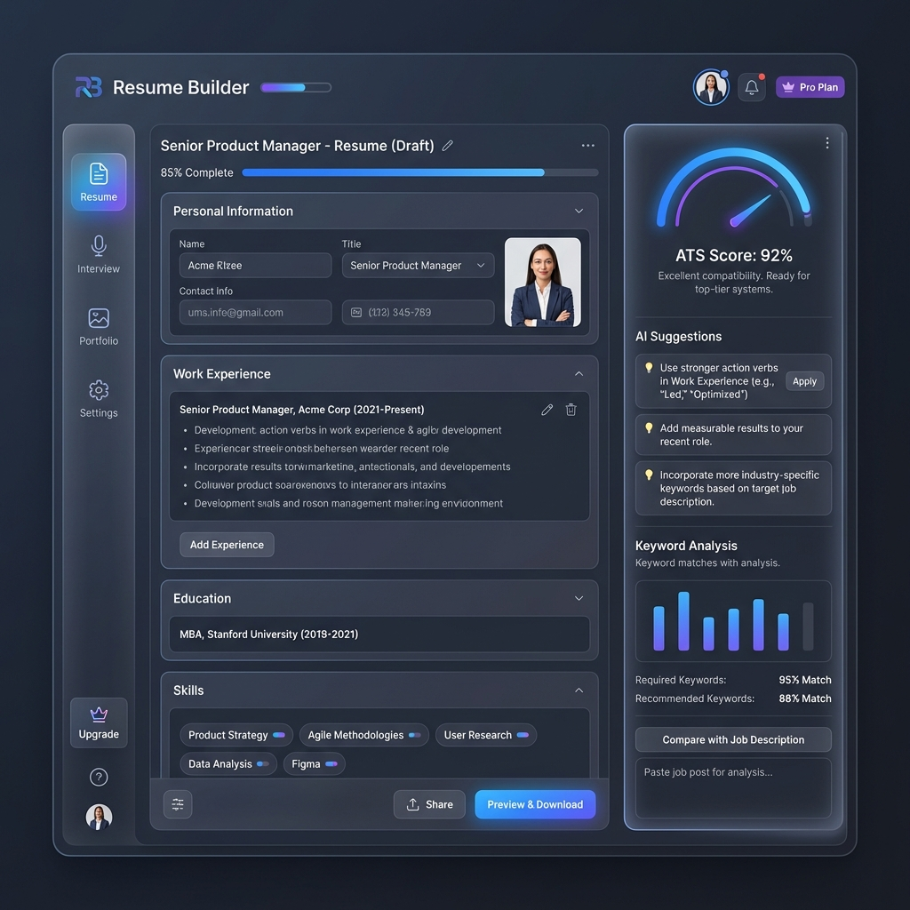

<div align="center">

# ⚡ ResumeForge

### *AI-Powered Career Platform for Students & Early Professionals*

[](https://resume-builder-plan.vercel.app/)
[](https://github.com/MeeksonJr/resume-builder-plan)
[](LICENSE)

[](#)
[](#)
[](#)
[](#)
[](#)

> ResumeForge is a full-stack, AI-powered career platform built exclusively for college students and early-career professionals. Upload your resume, let AI optimize it for ATS, practice mock interviews with voice, verify your university email, and connect with your campus student cohort — all in one beautifully designed workspace.

---



</div>

---

## 📑 Table of Contents

- [✨ Key Features](#-key-features)
- [🏗 Architecture](#-architecture)
- [🛠 Tech Stack](#-tech-stack)
- [🔐 Authentication & Verification System](#-authentication--verification-system)
- [📧 Email System (Gmail SMTP)](#-email-system-gmail-smtp)
- [🎓 University Verification](#-university-verification)
- [🤖 AI Provider Stack](#-ai-provider-stack)
- [🚀 Getting Started](#-getting-started)
- [⚙️ Environment Variables](#️-environment-variables)
- [🗄 Database Schema](#-database-schema)
- [📂 Project Structure](#-project-structure)
- [🗺 Roadmap](#-roadmap)

---

## ✨ Key Features

### 🎨 Auth & Identity
| Feature | Description |
|---|---|
| **Liquid Auth UI** | Full-width, two-column auth page with fluid water-wave animations between Sign In / Sign Up / Confirm tabs |
| **Email Verification** | Real Gmail SMTP (Nodemailer) sends branded 6-digit OTP codes to school & personal emails |
| **24-Hour Demo Trial** | Sign-up tab launches a sandboxed demo workspace; trial gate enforces verification after 24 hours |
| **Triple-Layer Security** | Middleware → Server layout → Client modal — unverified users cannot bypass dashboard access via URL or JS tricks |
| **Theme Toggle** | Floating island navbar with animated dark/light mode toggle, all components respond instantly |

### 📄 Resume Builder
| Feature | Description |
|---|---|
| **PDF Parsing** | Upload any PDF resume and auto-extract all sections into editable structured data |
| **AI Bullet Writer** | Generate, rewrite, and tailor bullet points using Groq Llama / Gemini / OpenAI |
| **ATS Score & Optimization** | Real-time ATS compatibility score with targeted improvement suggestions |
| **Job Description Tailoring** | Paste any JD and instantly tailor your resume's language and keywords |
| **Multi-Template PDF Export** | Modern, Classic, Minimal, Creative — all ATS-compliant, pixel-perfect exports |
| **Version History** | Every save creates a restorable version snapshot |

### 🎤 AI Interview Prep
| Feature | Description |
|---|---|
| **Behavioral & Technical Q&A** | AI generates relevant questions from your resume and target role |
| **Voice Interview Mode** | Record answers using Web Speech API, transcribed in real-time |
| **STAR Framework Scoring** | AI evaluates answers on Situation, Task, Action, Result dimensions |
| **Instant Feedback** | Score, weak points, and model answer generated within 1-3 seconds |

### 🎓 Student Career Network
| Feature | Description |
|---|---|
| **University Email Verification** | Sends OTP to official `.edu`, `.vccs.edu`, and consortium email addresses |
| **Canvas LMS Integration** | Verify enrollment via Canvas token — pulls courses, GPA, assignments to resume |
| **Campus Cohort Directory** | Browse verified students from your university, connect, and peer-review resumes |
| **Reverse Job Board** | Recruiter marketplace — employers send intro requests to verified student profiles |

### 💼 Additional Tools
- **📊 Career Analytics** — AI-powered career trajectory insights and salary benchmarking
- **💌 Cover Letter Generator** — AI cover letters tailored to specific job descriptions
- **📁 Portfolio Builder** — Drag-and-drop portfolio microsites with public shareable URLs
- **🔍 Job Tracker** — Kanban board to track applications, interviews, and offers
- **🎓 Scholarships & Grants** — Curated funding database matched to your profile
- **💾 Memory System** — AI learns your career context across sessions for personalized suggestions

---

## 🏗 Architecture

### Security Model (3 Layers)
```
Layer 1 — middleware.ts
  ├── Checks every /dashboard request server-side
  ├── Validates Supabase session token
  └── Checks demo_trial_started_at → redirects if expired

Layer 2 — app/dashboard/layout.tsx
  ├── Server-side double-check on every page
  ├── Syncs email_verified from auth.users → profiles
  └── Renders VerificationGateModal when trial expired

Layer 3 — VerificationGateModal (Client)
  ├── Full-screen frosted overlay (z-9999)
  ├── No close button, no backdrop dismiss
  └── Escape key intercepted at capture phase
```

### AI Fallback Chain
```
Request → Groq (Llama 3.3 70B)  [Primary — Ultra Fast]
             ↓ (on error)
          Gemini 2.0 Flash       [Secondary — High Quality]
             ↓ (on error)
          OpenAI GPT-4o-mini     [Fallback — Reliable]
```

---

## 🛠 Tech Stack

### Frontend
| Technology | Version | Purpose |
|---|---|---|
| **Next.js** | 15 (App Router) | Full-stack framework, RSC, Server Actions |
| **TypeScript** | 5.x | Full type safety |
| **Tailwind CSS** | v4 | Utility-first styling |
| **shadcn/ui** | Latest | Accessible component primitives |
| **Framer Motion** | 11 | Liquid animations, page transitions |
| **next-themes** | Latest | Dark/light mode with zero flash |

### Backend & Data
| Technology | Version | Purpose |
|---|---|---|
| **Supabase** | Latest | PostgreSQL + Auth + RLS + Storage |
| **@supabase/ssr** | Latest | Server-side auth with cookie management |
| **Nodemailer** | 6.x | Gmail SMTP transactional email |
| **Stripe** | Latest | Subscription billing |

### AI & External APIs
| Provider | Model | Role |
|---|---|---|
| **Groq** | Llama 3.3 70B | Primary — ultra-fast inference |
| **Google AI** | Gemini 2.0 Flash | Secondary — structured output |
| **OpenAI** | GPT-4o-mini | Fallback — reliable uptime |
| **RapidAPI** | Google Search Master | University discovery |
| **Canvas LMS** | REST v1 | Student enrollment verification |

---

## 🔐 Authentication & Verification System

ResumeForge uses a **multi-stage auth flow** built on Supabase with a custom verification gate system.

### Auth Flow
```
[Auth Page]
  │
  ├── Sign In Tab ──────────────────→ [Dashboard]
  │
  ├── Sign Up Tab
  │   ├── Fill form + Submit
  │   │   └── [Confirm Email Tab] ──→ [Dashboard]
  │   └── "Launch Instant Demo"
  │       └── Stamps demo_trial_started_at
  │           └── [Dashboard] ─────→ [Verification Gate after 24h]
  │
  └── Reset Password Tab
```

### Demo Trial Gate
When a user clicks **"Launch Instant Demo Workspace"** on the Sign Up tab:
1. Signs in as the `demo@resumeforge.ai` account
2. Calls `POST /api/demo/activate` to stamp `demo_trial_started_at = NOW()`
3. Dashboard is fully accessible for **24 hours**
4. After 24 hours → middleware redirects to `/auth/login?mode=confirm`
5. User must verify their own email to unlock permanent access

---

## 📧 Email System (Gmail SMTP)

ResumeForge uses **Nodemailer with Gmail SMTP** (App Password) as the primary email delivery system — no domain verification required.

### Email Types
| Template | Trigger | Description |
|---|---|---|
| **Account Confirmation** | Supabase sign-up | Branded email with 6-digit OTP |
| **School Verification** | Onboarding step 3 | OTP sent to `.edu` school email |
| **Password Reset** | Forgot password flow | Secure reset link |

### Setup
```env
GMAIL_USER=your.email@gmail.com
GMAIL_APP_PASSWORD=xxxx xxxx xxxx xxxx
GMAIL_FROM_NAME=ResumeForge
```

> **Fallback stack**: Gmail SMTP → Microsoft 365 / Outlook SMTP → Resend API

---

## 🎓 University Verification

The onboarding wizard (Step 3) supports two verification paths:

### Method 1: School Email OTP
- Enter `.edu` or consortium email address
- 6-digit OTP sent via Gmail SMTP
- Accepted: `.edu`, `.ac.uk`, `.edu.au`, `.vccs.edu`

### Method 2: Canvas LMS Token
- Provide Canvas instance URL + personal access token
- API verifies enrollment and pulls course data
- Course data can be auto-imported to resume bullets

### Supported Institutions (Preset)
| Institution | Email Domain |
|---|---|
| Old Dominion University | `@odu.edu`, `@cs.odu.edu` |
| Tidewater Community College | `@email.vccs.edu`, `@vccs.edu` |
| Stanford University | `@stanford.edu` |
| MIT | `@mit.edu` |
| UC Berkeley | `@berkeley.edu` |
| *Any `.edu` institution* | Auto-accepted |

---

## 🤖 AI Provider Stack

```typescript
// Priority order on every AI request
const providers = [
  groq("llama-3.3-70b-versatile"),   // 1st: Ultra-fast (Groq)
  google("gemini-2.0-flash"),         // 2nd: High quality (Google)
  openai("gpt-4o-mini"),             // 3rd: Reliable fallback (OpenAI)
];
```

| Use Case | Primary Model |
|---|---|
| Bullet Point Generation | Groq Llama 3.3 |
| Resume Analysis / ATS | Gemini 2.0 Flash |
| Interview Feedback | Groq → Gemini |
| Cover Letter Generation | Groq Llama 3.3 |

---

## 🚀 Getting Started

### Prerequisites
- **Node.js** 18+ and **pnpm**
- A [Supabase](https://supabase.com/) project (free tier works)
- Gmail account with [App Password](https://myaccount.google.com/apppasswords) enabled
- A [Groq API Key](https://console.groq.com/) (free tier)

### 1. Clone & Install
```bash
git clone https://github.com/MeeksonJr/resume-builder-plan.git
cd resume-builder-plan
pnpm install
```

### 2. Environment Setup
```bash
cp .env.example .env.local
# Fill in your values (see Environment Variables below)
```

### 3. Database Migrations
```bash
# Via Supabase CLI
supabase db push

# OR manually via SQL Editor — run all files in supabase/migrations/ in order
# Critical for demo trial gate (migration 047):
```

```sql
ALTER TABLE public.profiles
  ADD COLUMN IF NOT EXISTS demo_trial_started_at TIMESTAMPTZ,
  ADD COLUMN IF NOT EXISTS is_demo_user BOOLEAN DEFAULT false,
  ADD COLUMN IF NOT EXISTS email_verified BOOLEAN DEFAULT false;
```

### 4. Create Demo Account in Supabase
Dashboard → Authentication → Users → Create User:
- **Email:** `demo@resumeforge.ai`
- **Password:** `monarch-career-2026`
- Set **Email Confirmed** → `true`

### 5. Run Dev Server
```bash
pnpm dev
# Open http://localhost:3000
```

---

## ⚙️ Environment Variables

```env
# Supabase
NEXT_PUBLIC_SUPABASE_URL=https://xxxx.supabase.co
NEXT_PUBLIC_SUPABASE_ANON_KEY=eyJhbGciOi...
SUPABASE_SERVICE_ROLE_KEY=eyJhbGciOi...

# AI Providers
GROQ_API_KEY=gsk_...
GOOGLE_GENERATIVE_AI_API_KEY=AIzaSy...
OPENAI_API_KEY=sk-...

# Email (Gmail SMTP)
GMAIL_USER=your.email@gmail.com
GMAIL_APP_PASSWORD=xxxx xxxx xxxx xxxx
GMAIL_FROM_NAME=ResumeForge

# Stripe
STRIPE_SECRET_KEY=sk_live_...
STRIPE_WEBHOOK_SECRET=whsec_...
NEXT_PUBLIC_STRIPE_PUBLISHABLE_KEY=pk_live_...

# RapidAPI
RAPIDAPI_KEY=your_rapidapi_key

# App
NEXT_PUBLIC_APP_URL=https://resume-builder-plan.vercel.app
NEXT_PUBLIC_DEV_SUPABASE_REDIRECT_URL=http://localhost:3000/dashboard
```

---

## 🗄 Database Schema

<details>
<summary><strong>Click to expand — Core tables overview</strong></summary>

### `profiles` (Extended from `auth.users`)
| Column | Type | Description |
|---|---|---|
| `id` | UUID | FK → `auth.users` |
| `full_name` | TEXT | Display name |
| `is_pro` | BOOLEAN | Pro subscription flag |
| `subscription_status` | TEXT | `active`, `trialing`, `canceled` |
| `is_student` | BOOLEAN | Student flag |
| `university_name` | TEXT | Selected institution |
| `school_email` | TEXT | Verified `.edu` email |
| `school_verified` | BOOLEAN | Campus verification status |
| `onboarding_completed` | BOOLEAN | First-run wizard done |
| `demo_trial_started_at` | TIMESTAMPTZ | When 24h trial began |
| `is_demo_user` | BOOLEAN | Demo account flag |
| `email_verified` | BOOLEAN | Synced from `auth.users` |
| `marketplace_active` | BOOLEAN | Reverse job board opt-in |

### Key Tables
- **`resumes`** — JSONB resume data (JSON Resume Schema) + ATS metadata
- **`resume_versions`** — Full version history with restore
- **`interview_answers`** / **`interview_feedback`** — Mock interview sessions + AI scoring
- **`portfolios`** — Public microsite configs with custom slugs
- **`job_tracker`** — Kanban application tracking
- **`school_verification_codes`** — OTP codes with TTL
- **`university_insights_cache`** — Cached RapidAPI data
- **`marketplace_intro_requests`** — Recruiter → Student connections
- **`salary_benchmarks`** — Market salary data
- **`career_analytics_snapshots`** — Historical career metrics

All tables use **Row Level Security (RLS)**.

</details>

---

## 📂 Project Structure

<details>
<summary><strong>Click to expand full folder tree</strong></summary>

```
resume-builder-plan/
├── app/
│   ├── (marketing)/          # Landing page, pricing, blog
│   ├── auth/                 # Auth pages (login, sign-up, confirm, reset)
│   │   └── layout.tsx        # Full-width liquid auth layout
│   ├── dashboard/            # Protected workspace
│   │   ├── layout.tsx        # Verification gate + sidebar + topnav
│   │   ├── resumes/          # Resume list and editor
│   │   ├── interview-prep/   # AI mock interview
│   │   ├── career-coach/     # AI career coaching
│   │   ├── cover-letters/    # Cover letter generator
│   │   ├── jobs/             # Job tracker kanban
│   │   ├── portfolio/        # Portfolio microsite builder
│   │   ├── marketplace/      # Student <-> Recruiter marketplace
│   │   ├── scholarships/     # Funding opportunities
│   │   ├── analytics/        # Career analytics
│   │   └── settings/         # Account settings
│   └── api/
│       ├── ai/               # AI generation endpoints
│       ├── demo/activate/    # Demo trial stamp
│       ├── university/       # Verification + Canvas + search
│       └── email/            # Nodemailer routes
│
├── components/
│   ├── auth/
│   │   ├── liquid-auth-card.tsx         # 3-tab liquid auth UI
│   │   ├── auth-showcase-panel.tsx      # Left panel feature highlights
│   │   ├── floating-auth-nav.tsx        # Floating nav + theme toggle
│   │   ├── liquid-wave.tsx              # Wave animation background
│   │   ├── auth-success-celebration.tsx # Post-auth success screen
│   │   └── verification-gate-modal.tsx  # Inescapable lockout modal
│   ├── onboarding/
│   │   └── user-onboarding-dialog.tsx  # 4-step wizard
│   ├── dashboard/                       # Sidebar, topnav, command menu
│   └── ui/                              # shadcn/ui components
│
├── lib/
│   ├── supabase/
│   │   ├── client.ts                   # Browser Supabase client
│   │   ├── server.ts                   # Server Supabase client
│   │   └── proxy.ts                    # Middleware session manager
│   └── rapidapi/
│       └── google-search-master.ts     # University discovery
│
├── middleware.ts               # Auth + demo trial enforcement
└── supabase/
    ├── migrations/             # 47+ SQL migration files
    └── templates/              # Supabase email HTML templates
```

</details>

---

## 🗺 Roadmap

### ✅ Completed
- [x] Full-width liquid auth UI with dark/light mode
- [x] Gmail SMTP email verification (Nodemailer)
- [x] University email OTP verification (`.edu`, `vccs.edu`)
- [x] Canvas LMS enrollment verification
- [x] 24-hour demo trial gate (3-layer security)
- [x] AI resume builder with ATS scoring
- [x] AI mock interview with STAR scoring
- [x] Portfolio microsite builder
- [x] Job application tracker
- [x] Career analytics snapshots
- [x] Salary benchmarking
- [x] Scholarship & grant directory
- [x] Reverse job board marketplace
- [x] Resume version history
- [x] Campus cohort student directory

### 🔜 In Progress
- [ ] Real-time collaborative peer review
- [ ] AI career path progression analyzer
- [ ] LinkedIn profile import/sync

### 🔭 Planned
- [ ] Mobile app (React Native / Expo)
- [ ] Skills gap analysis against job market
- [ ] Campus recruiter portal
- [ ] Resume A/B testing with analytics

---

## 🤝 Contributing

1. Fork the repository
2. Create your feature branch: `git checkout -b feat/amazing-feature`
3. Commit your changes: `git commit -m 'feat: add amazing feature'`
4. Push: `git push origin feat/amazing-feature`
5. Open a Pull Request

---

## 📄 License

This project is licensed under the **MIT License**.

---

<div align="center">

**Built with ❤️ for students and early-career professionals**

[](https://resume-builder-plan.vercel.app/)

*If ResumeForge helped you land an interview, give it a ⭐!*

</div>
